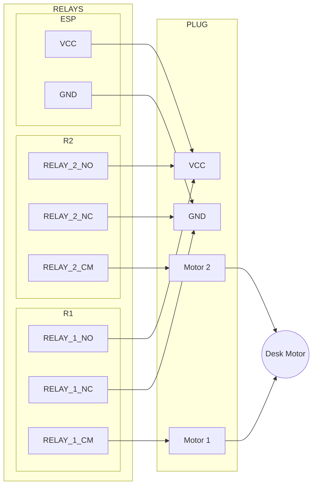

```mermaid
flowchart LR
subgraph PLUG
  direction TB
  WHITE[Motor 1]
  BLACK[GND]
  RED[VCC]
  GREEN[Motor 2]
end

subgraph RELAYS
  direction TB
  subgraph R1
    direction TB
    RELAY_1_NO --> RED
    RELAY_1_NC --> BLACK
    RELAY_1_CM --> WHITE
  end

  subgraph R2
    direction TB
    RELAY_2_NO --> RED
    RELAY_2_NC --> BLACK
    RELAY_2_CM --> GREEN
  end

  subgraph ESP
    ControllerVCC[VCC] --> RED
    ControllerGND[GND] --> BLACK
  end
end

Motor((Desk Motor))
GREEN --> Motor
WHITE --> Motor
```
